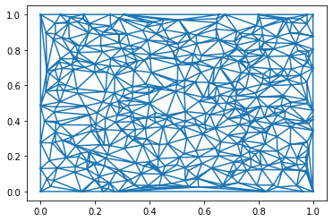
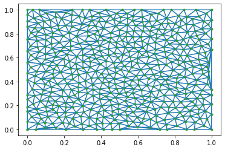
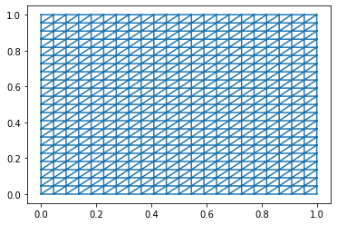
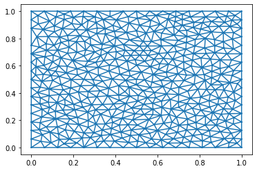
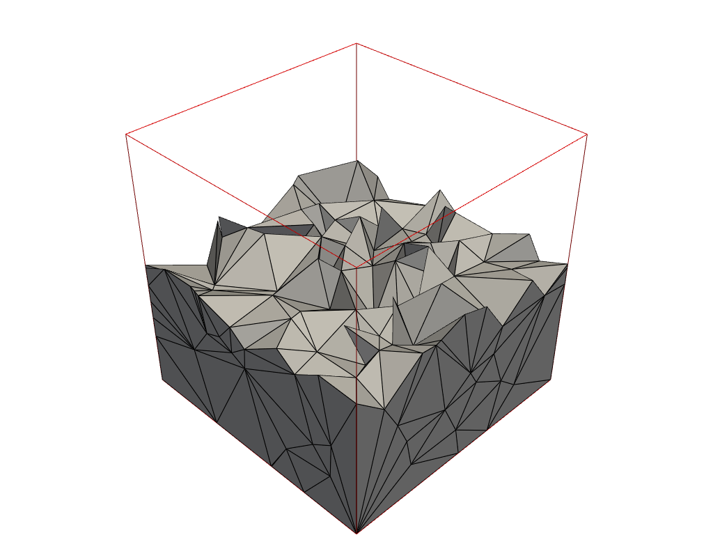
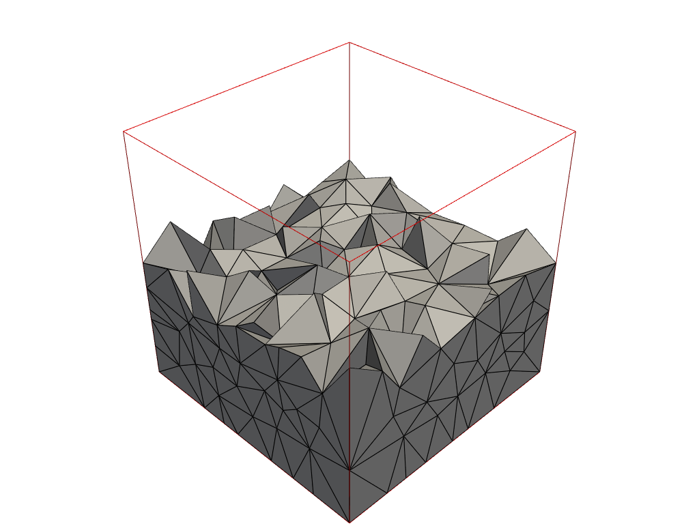
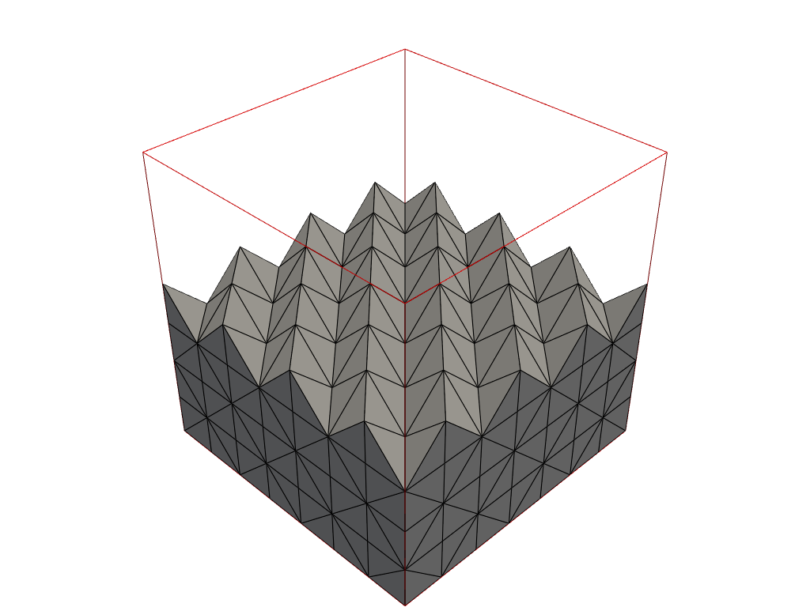
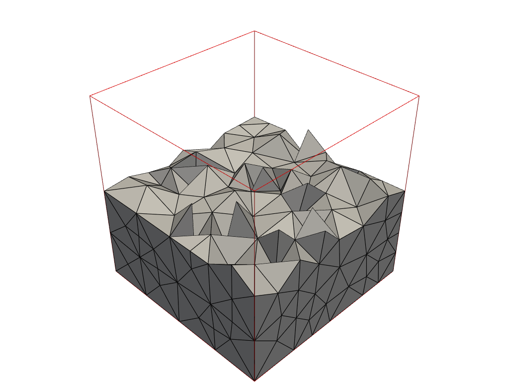

# 2D-3D-Mesh-sampling-for-experiments

Dataset used for experiments related to 2D and 3D Polylla meshes, such as volume meshes. 

Additional libraries include NumPy for data manipulation and meshio for printing meshes to an OFF file.

## 2D

The random and Poisson meshes were created with **Scipy**, Uniform is self-created , and Shewchuk's Triangle with **Triangle**.

For the visualization of the meshes, **Matplotlib** was used.

| Random               | Poisson              | Uniform              | Shewchuk's Triangle  |
| -------------------- | -------------------- | -------------------- | -------------------- |
|  |  |  |  |

## En 3D 

Random and Poisson were created with **Scipy**, Uniform with **meshzoo** and Tetgen with **Tetgen**.

For the visualization of the meshes, **pyVista** was used.

| Random            | Poisson              | Uniform               | Tetgen               |
| ----------------- | -------------------- | --------------------- | -------------------- |
|  |  |  |  |
